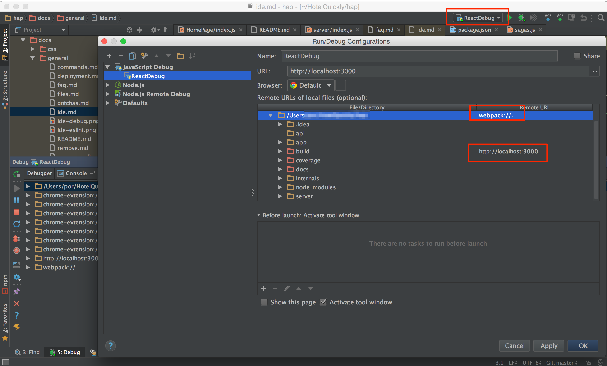
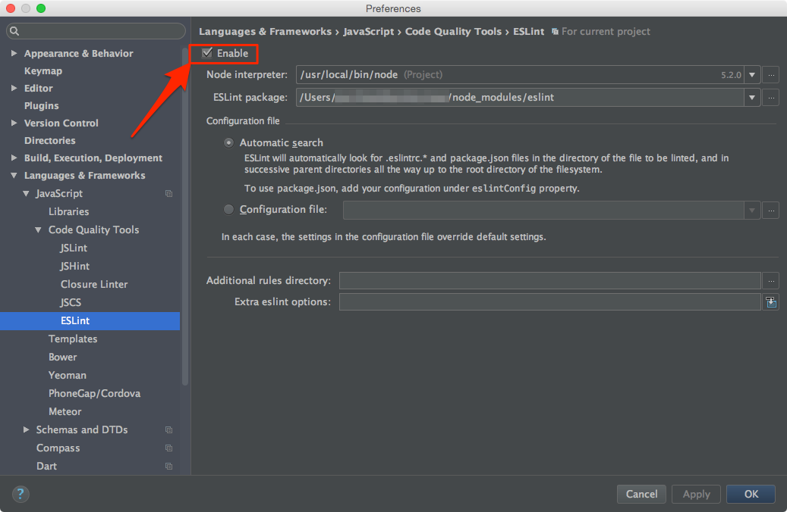

# Debugging

## Table of Contents

- [Debugging with VC Code](#debugging-with-vscode)
- [Debugging with WebStorm](#debugging-with-webStorm)
  - [Troubleshooting](#troubleshooting)
  - [Enable ESLint](#enable-eslint)

## Debugging with Visual Studio Code

You can super charge your React debugging workflow with VS Code and Chrome debugging by using this `launch.json` config:

```json
{
    "version": "0.2.0",
    "configurations": [
        {
            "type": "chrome",
            "request": "launch",
            "name": "Launch Chrome",
            "url": "http://localhost:3000",
            "webRoot": "${workspaceRoot}/app",
            "sourceMapPathOverrides": {
                "webpack:///./app/*": "${webRoot}/*",
                "webpack:///app/*": "${webRoot}/*"
            }
        }
    ]
}
```

You can read more in [Live edit and debug your React apps directly from VS Code — without leaving the editor 🔥 🎉🎈](https://medium.com/front-end-hacking/live-edit-and-debug-your-react-apps-directly-from-vs-code-without-leaving-the-editor-3da489ed905f)

**Note**: There's currently a [known problem](https://github.com/react-boilerplate/react-boilerplate/pull/1698) with source maps and VS Code. You can change your webpack config to use `inline-source-map` and the issue should be resolved.


## Debugging with WebStorm

WebStorm is a powerful IDE, and why not also use it as debugger tool? Here is the steps

1.  [Install JetBrain Chrome Extension](https://chrome.google.com/webstore/detail/jetbrains-ide-support/hmhgeddbohgjknpmjagkdomcpobmllji)
2.  [Setting up the PORT](https://www.jetbrains.com/help/webstorm/2016.1/using-jetbrains-chrome-extension.html)
3.  Change WebPack devtool config to `source-map` [(This line)](https://github.com/react-boilerplate/react-boilerplate/blob/56eb5a0ec4aa691169ef427f3a0122fde5a5aa24/internals/webpack/webpack.dev.babel.js#L65)
4.  Run web server (`npm run start`)
5.  Create Run Configuration (Run > Edit Configurations)
6.  Add new `JavaScript Debug`
7.  Setting up URL
8.  Start Debug (Click the green bug button)
9.  Edit Run Configuration Again
10.  Mapping Url as below picture
    * Map your `root` directory with `webpack://.` (please note the last dot)
    * Map your `build` directory with your root path (e.g. `http://localhost:3000`)
11.  Hit OK and restart debugging session



### Troubleshooting

1. You miss the last `.` (dot) in `webpack://.`
2. The port debugger is listening tool and the JetBrain extension is mismatch.

### Enable ESLint

ESLint help making all developer follow the same coding format. Please also setting up in your IDE, otherwise, you will fail ESLint test.
1. Go to WebStorm Preference
2. Search for `ESLint`
3. Click `Enable`




## Have another question?

Submit an [issue](https://github.com/react-boilerplate/react-boilerplate/issues),
hop onto the [Gitter channel](https://gitter.im/mxstbr/react-boilerplate)
or contact Max direct on [twitter](https://twitter.com/mxstbr)!
