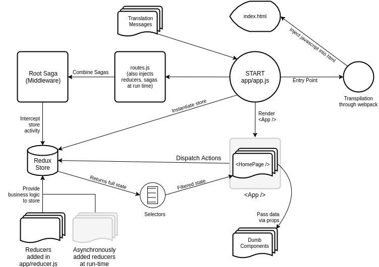

# The Hitchhikers Guide to `react-boilerplate`

The [`README.md`](https://github.com/react-boilerplate/react-boilerplate#features) gives you adequate information on how to clone boilerplate files, install dependencies and launch the example app.

Once you have done that, this document is intended to give you a taste of how `react-boilerplate` works. It still assumes basic knowledge of React, Redux and `react-router`. **If you're completely new to React, please refer to https://github.com/petehunt/react-howto instead!**

This is a production-ready boilerplate, and as such optimized for browsers, not for beginners. It includes tools to help you manage performance, asynchrony, styling, everything you need to build a _real_ application. Before you get your hands dirty with the source code, we'd like you to go through a checklist, that will help you determine whether or not you're eligible to use this boilerplate. It's not because we're _holier-than-thou_, but we genuinely want to save you the frustration.

> Opening an issue is the fastest way to draw the attention of the team, but please make it a point to read the [docs](https://github.com/react-boilerplate/react-boilerplate/tree/master/docs) and [contribution instructions](https://github.com/react-boilerplate/react-boilerplate/blob/master/.github/CONTRIBUTING.md) before you do. The issues section is specifically used for pointing out defects and suggesting enhancements, if you have a question about one of the tools please refer to StackOverflow instead.

## Tech Stack

Here's a curated list of packages that you should have knowledge of, before starting your awesome project. However, the best way to have a complete list of dependencies is to see [package.json](https://github.com/react-boilerplate/react-boilerplate/blob/master/package.json).

### Core

- [ ] [React](https://facebook.github.io/react/)
- [ ] [React Router](https://github.com/ReactTraining/react-router)
- [ ] [Redux](http://redux.js.org/)
- [ ] [Redux Saga](https://redux-saga.github.io/redux-saga/)
- [ ] [Reselect](https://github.com/reactjs/reselect)
- [ ] [ImmutableJS](https://facebook.github.io/immutable-js/)
- [ ] [Styled Components](https://github.com/styled-components/styled-components)

### Unit Testing

- [ ] [Jest](http://facebook.github.io/jest/)
- [ ] [Enzyme](http://airbnb.io/enzyme/)

### Linting

- [ ] [ESLint](http://eslint.org/)

Note that while `react-boilerplate` includes a lot of features, many of them are optional and you can find instructions in the docs on how to remove...

- [...`redux-saga` or `reselect`](https://github.com/react-boilerplate/react-boilerplate/blob/master/docs/js/remove.md).
- ...[offline-first, add to homescreen, performant web font loading and image optimisation](https://github.com/react-boilerplate/react-boilerplate/blob/master/docs/general/remove.md)
- [`sanitize.css`](https://github.com/react-boilerplate/react-boilerplate/blob/master/docs/css/remove.md)
- [i18n (i.e. `react-intl`)](https://github.com/react-boilerplate/react-boilerplate/blob/0f88f55ed905f8432c3dd7b452d713df5fb76d8e/docs/js/i18n.md#removing-i18n-and-react-intl)

## Project Structure

Let's start with understanding why we have chosen our particular structure. It has been an [evolving discussion](https://github.com/react-boilerplate/react-boilerplate/issues/27), and if you have an afternoon or two we recommend you read the full thread.

If not, here's the TL;DR:

- You will write your app in the `app` folder. This is the folder you will spend most, if not all, of your time in.
- Configuration, generators and templates are in the `internals` folder.
- The `server` folder contains development and production server configuration files.

### `app/`

We use the [container/component architecture](https://medium.com/@dan_abramov/smart-and-dumb-components-7ca2f9a7c7d0#.4rmjqneiw). `containers/` contains React components which are connected to the redux store. `components/` contains dumb React components which depend on containers for data. **Container components care about how things work, while components care about how things look.**

We've found that for many applications treating single pages (e.g. the Loginpage, the Homepage etc.) as containers and their small parts (e.g. the Login form, the Navigation bar) as components works well, but there are no rigid rules. **Bend the architecture to the needs of your app, nothing is set in stone!**

### `internals/`

You can call this area the "engine" of your app. Your source code cannot be executed as-is in the web browser. It needs to pass through webpack to get converted into a form that web browsers understand. While it's certainly helpful to understand what is happening here, for real world usage you won't have to mess around with this folder much.

- `internals/webpack`: You'll most probably use EcmaScript 6 or EcmaScript 7 to write the source code of your app. webpack takes care of making it compatible with a majority of browsers.

> ([ECMAScript](http://stackoverflow.com/a/33748400/5241520) is the standard for JavaScript. Most people are still using browsers which understand ECMAScript 5. So your code must be [transpiled](https://scotch.io/tutorials/javascript-transpilers-what-they-are-why-we-need-them) into browser-understandable code. To apply the transpiler to your source code, you will use webpack. Feeling the jitters already? [Don't worry](https://hackernoon.com/how-it-feels-to-learn-javascript-in-2016-d3a717dd577f#.d2uasw2n6). Take a tea-break and then read on)

- `internals/generators`: This folder has the code to scaffold out new components, containers and routes. Read [more about scaffolding](https://github.com/react-boilerplate/react-boilerplate/tree/master/docs/general#quick-scaffolding) in the docs.

- `internals/mocks`: This folder contains mocks which Jest uses when testing your app, e.g. for images.

The other folders are mostly for the maintainers and/or the setup, and you should absolutely never need to touch them so we are going skip them for the sake of brevity.

### `server/`

As the name suggests, this folder contains development and production server configuration.

## Basic Building Blocks

These days when musicians produce music, they record different parts of the song separately. So vocals, drums, guitar, bass may be played in separate sessions and when they're satisfied with their work, the sessions are combined into a beautiful song. In a similar fashion, let's understand the role of different technologies and in the end, we'll see how everything converges into a single application.

You can launch the example app by running `npm start`. To fully understand its inner workings, you'll have to understand multiple technologies and how they interact. From this point, we're going into an overdrive of implementation details. We'll simplify the technical jargon as much as we can. Please bear with us here.

### How does the application boot up?

Like any other webpage your app starts with the [`app/index.html`](https://github.com/react-boilerplate/react-boilerplate/blob/master/app/index.html) file. React will render your application into the `div#app` .

But how do we include all of your react components into a single html file? That's where webpack comes into the picture. Webpack will literally pack your application into small javascript files. These files will be injected into the `index.html` as `<script>` tags.

When your application is deployed on a server, browsers will load this html file. The javascript files that webpack has included will be executed by the browser, thereby booting up your react application! It's magic really!! No, not really, though it can certainly seem that way. Let's dissect this phenomenon to better know what's really going on.

### `app/app.js`:

When you run `npm start`, a server will be launched in your terminal for development. You can then open [http://localhost:3000](http://localhost:3000) to access the server and see your app.

Webpack requires an entry point to your application. Think of it as a door to your source code. In this boilerplate [`app/app.js`](https://github.com/react-boilerplate/react-boilerplate/blob/master/app/app.js) is that entry point. Webpack will access the entire app from this file, transpile the application into ES5 and create small chunks of transpiled code. Only the required chunks will be loaded in the browser so that you don't have to worry about the size of your application.

`app/app.js` is one of the biggest files of the boilerplate. It contains all the global setup to make sure your app runs smoothly. Let's break its contents down:

- `babel-polyfill` is imported. This enables cool stuff like generator functions, `Promise`s, etc.
- A redux `store` is instantiated.
- A `history` object is created, which remembers all the browsing history for your app. This is used by the router to know which page your users visit. (very useful for analytics, by the way)
- A Router is connected to Redux.
- Hot module replacement setup via vanilla [Webpack HMR](https://webpack.js.org/guides/hot-module-replacement/) that makes all the reducers, injected sagas, components, containers, and i18n messages hot reloadable. 
- i18n internationalization support setup.
- Offline plugin support to make your app [offline-first](https://developers.google.com/web/fundamentals/getting-started/codelabs/offline/).
- `ReactDOM.render()` not only renders the [root react component](https://github.com/react-boilerplate/react-boilerplate/blob/master/app/containers/App/index.js) called `<App />`, of your application, but it renders it with `<Provider />`, `<LanguageProvider />` and `<Router />`.
 * `<Provider />` connects your app with the redux `store`.
 * `<LanguageProvider />` provides language translation support to your app. 

### Redux

Redux is going to play a huge role in your application. If you're new to Redux, we'd strongly suggest you to complete this checklist and then come back:

- [ ] Understand the motivation behind Redux
- [ ] Understand the three principles of Redux
- [ ] Implement Redux in a small React app of yours

The Redux `store` is the heart of your application. Check out [`configureStore.js`](https://github.com/react-boilerplate/react-boilerplate/blob/master/app/configureStore.js) to see how we have configured the store.

The store is created with the `createStore()` factory, which accepts three parameters.

1. **Root reducer:** A master reducer combining all your reducers.
2. **Initial state:** The initial state of your app as determined by your reducers.
3. **Middleware/enhancers:** Middlewares are third party libraries which intercept each redux action dispatched to the redux store and then... do stuff. For example, if you install the [`redux-logger`](https://github.com/evgenyrodionov/redux-logger) middleware, it will listen to all the actions being dispatched to the store and print previous and next state in the browser console. It's helpful to track what happens in your app.

In our application we are using two such middleware.

1. **Router middleware:** Keeps your routes in sync with the redux `store`.
2. **Redux saga:** Is used for managing _side-effects_ such as dispatching actions asynchronously or accessing browser data.

### Reselect

Reselect is a library used for slicing your redux state and providing only the relevant sub-tree to a react component. It has three key features:

1. Computational power
2. Memoization
3. Composability

Imagine an application that shows a list of users. Its redux state tree stores an array of usernames with signatures:

`{
  id: number,
  username: string,
  gender: string,
  age: number
}`.

Let's see how the three features of reselect help.

- **Computation:** While performing a search operation, reselect will filter the original array and return only matching usernames. Redux state does not have to store a separate array of filtered usernames.
- **Memoization:** A selector will not compute a new result unless one of its arguments change. That means, if you are repeating the same search once again, reselect will not filter the array over and over. It will just return the previously computed, and subsequently cached, result. Reselect compares the old and the new arguments and then decides whether to compute again or return the cached result.
- **Composability:** You can combine multiple selectors. For example, one selector can filter usernames according to a search key and another selector can filter the already filtered array according to gender. One more selector can further filter according to age. You combine these selectors by using `createSelector()`

### Redux Saga

If your application is going to interact with some back-end application for data, we recommend using redux saga for side effect management. Too much jargon? Let's simplify.

Imagine that your application is fetching data in json format from a back-end. For every API call, ideally you should define at least three kinds of [action creators](http://redux.js.org/docs/basics/Actions.html):

1. `API_REQUEST`: Upon dispatching this, your application should show a spinner to let the user know that something's happening.
2. `API_SUCCESS`: Upon dispatching this, your application should show the data to the user.
3. `API_FAILURE`: Upon dispatching this, your application should show an error message to the user.

And this is only for **_one_** API call. In a real-world scenario, one page of your application could be making tens of API calls. How do we manage all of them effectively? This essentially boils down to controlling the flow of your application. What if there was a background process that handles multiple actions simultaneously, communicates with redux store and react containers at the same time? This is where redux-saga comes into the picture.

The mental model is that a saga is like a separate thread in your application that's solely responsible for side effects. `redux-saga` is a redux middleware, which means this thread can be started, paused and cancelled from the main application with normal redux actions, it has access to the full redux application state and it can dispatch redux actions as well.

## Example App: Behind the scenes

The react-boilerplate building blocks interoperate to produce a seamless application. Let's join these pieces together.

### Workflow

The example application is a simple service which shows a list of repositories for GitHub users using GitHub's public API. You type in a username and the application will show you a list of repositories for that user. It also shows how navigating away to a different route can be done. You can switch between English and German by selecting the desired option from the menu in the footer.

#### `<HomePage />`

Run `npm start` to launch the application. If you start browsing at [https://localhost:3000](https://localhost:3000), by default you will be navigated to the home page. Here, notice that route is `"/"`, so the [`<HomePage />`](https://github.com/react-boilerplate/react-boilerplate/blob/master/app/containers/HomePage/index.js) container will be mounted. It is responsible for rendering a form with a textbox and a list of repositories.

- `mapDispatchToProps()`: Generally, we provide outgoing action creators (functions that create [action](http://redux.js.org/docs/basics/Actions.html) objects) to the react component through this method. Notice that for every keypress in textbox, your state will be updated by dispatching a `changeUsername` action to the store. So at any point in time, your Redux state will hold the currently typed username. When you submit the form, another action, `loadRepos` will be dispatched.

- `mapStateToProps()`: Generally, we provide incoming state from Redux store to the react component through this method. Notice that the we do not provide the entire state to the component, simply because we don't want the react component to have access to irrelevant data. The state will be filtered by selectors such as `selectRepos`, `selectUsername` etc.

Together these two methods work like magic. When you type something in the textbox the following things will happen in a sequential manner:

1. `changeUsername()` will send text to the Redux store. The text can be accessed using `evt.target.value`. Here, `evt` is the `onChange` event emmited by pressing a key.
2. The Redux store will consult with its corresponding reducer, since a reducer knows what to do with the data.
3. When a reducer computes a new state tree, the store will update its state with the newly typed data.
4. An update has occured in the state, therefore `mapStateToProps()` will be triggered and your react component will get the new data.
5. The updated data will be set as the `value` to your `<Input />`.

_So you see, if you type something in the textbox, it will not be directly reflected in the DOM. It must pass through redux. Redux will update the state and return it to the component. It's the component's responsibility to show the updated data._

#### `HomePage/saga.js`

You must be wondering where does the list of repositories come from! Sagas are primarily used for making API calls. Sagas intercept actions dispatched to the Redux store. That means a saga will listen to the actions and if it finds an action of interest, it will do something.

Sagas are nothing but ES6 [generator functions](https://developer.mozilla.org/en-US/docs/Web/JavaScript/Reference/Statements/function*). These functions act as normal functions, the only difference is that they can be "paused" and "resumed" at any point in time. `redux-saga` provides an intuitive, declarative API for managing asynchronous operations.

Check out [`HomePage/saga.js`](https://github.com/react-boilerplate/react-boilerplate/blob/master/app/containers/HomePage/saga.js). It can be confusing for untrained eyes. The API of `redux-saga` is self-descriptive once you've seen it, so let's go over what happens in there:

- You can `fork` a saga to send it to the background. That way, your code will not get blocked even when the saga is continuously running.
- `takeLatest` is used for listening for a particular action. In this case, it will wait for a `LOAD_REPOS` action. Whenever you disptach this action, the saga will understand that you want to fetch repos from github's public API by calling `getRepos()`.
- If the API successfully returns some data, a `reposLoaded()` action will be dispatched which carries the data. When redux store receives this action, [a reducer](https://github.com/react-boilerplate/react-boilerplate/blob/master/app/containers/App/reducer.js) will set incoming data in the new state tree.

_An update has occurred!_ `mapStateToProps()` will be triggered. `<HomePage />` will receive the new data and rerender.

## Why all this fuss just to load a list of repos?

Quite an understandable question!

In the example app, we're basically using a [bazooka](https://en.wikipedia.org/wiki/Bazooka) to kill a fly. The primary purpose of this boilerplate is to provide a robust and scalable infrastructure for large scale projects. Every bit of your project should be predictable. You should have granular control over all the operations. It's overkill for the example app, but not for the real world.

If you want to build a mature application you're going to need a mature infrastructure. That's what this boilerplate provides.
